# STM32 Smart Clock · Bare-Metal Firmware + Interactive Simulator

<p align="center">
  <a href="https://mohsensafari83.github.io/stm32-smart-clock/">
    
  </a>
  <a href="https://www.st.com/en/microcontrollers-microprocessors/stm32g030.html">
    
  </a>
  <a href="#">
    
  </a>
  <a href="#">
    
  </a>
</p>

<p align="center">
  <b>An STM32G030 Cortex-M0+ digital clock</b> · NTC thermistor · TM1637 display · PWM RGB LED · I²C EEPROM · 3-button menu FSM · UART logging · <b>plus a browser-based simulator with live visualization</b>
</p>

<p align="center">
  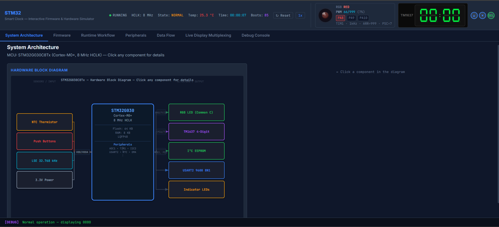
</p>

---

## Why This Project

Most embedded projects stop at firmware. This one combines real STM32 bare-metal code with a browser-based digital twin.

| Typical embedded project | This project                                             |
| ------------------------ | -------------------------------------------------------- |
| Source code only         | Firmware + interactive HTML simulator                    |
| Static documentation     | Data-driven SVGs regenerated from live firmware state    |
| Guess what the FSM does  | Animated state machine with real-time transition tracing |

Open `index.html` in any browser. No build step. No dependencies.

---

## Project Showcase

The simulator is a single HTML file (~10300 lines of vanilla JavaScript) that runs a hardware-accurate model of the STM32G030 and all connected peripherals. It exposes 7 debug perspectives, each answering a specific engineering question.

### Interactive Debugger

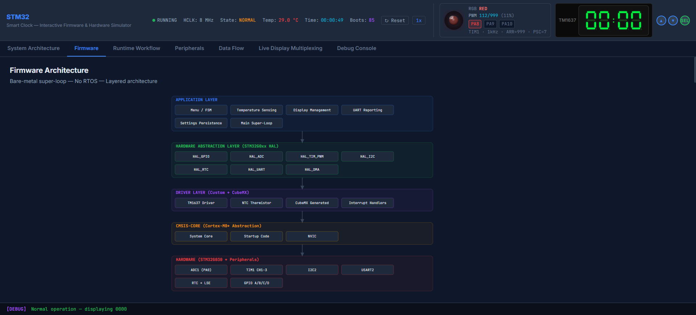

A real-time view of firmware state, peripherals, and signal propagation — all inside a browser.

### Architecture & Debugging

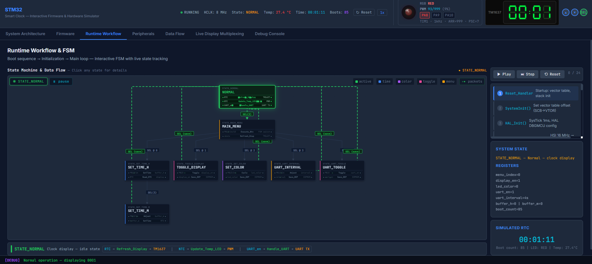

Layered system diagram with live state annotations. The Firmware Debugger tab shows module call graphs, data ownership, the IRQ table, and the clock tree.

### Finite State Machine

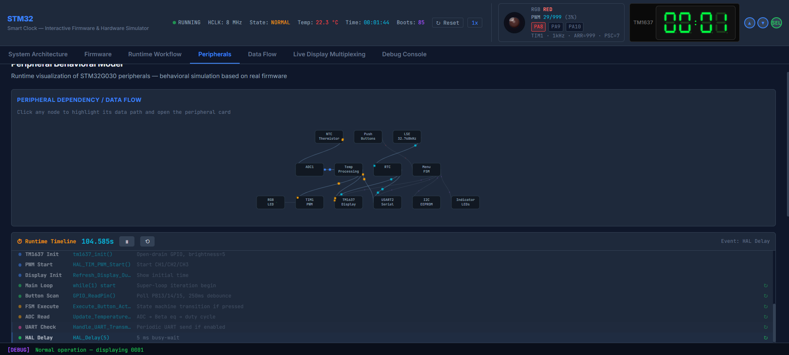

Animated 8-state machine with step-through mode. Watch transitions fire as buttons are pressed.

### Signal & Data Flow

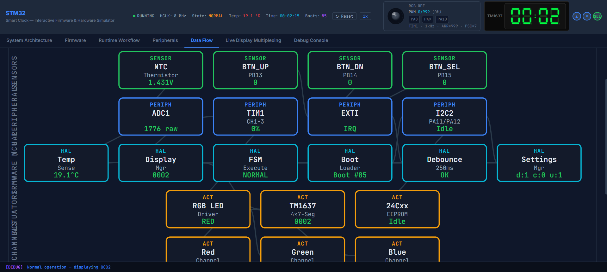

End-to-end signal chains with particle animation. Follow NTC → ADC → Beta → PWM → RGB in real time.

### Peripheral Inspector

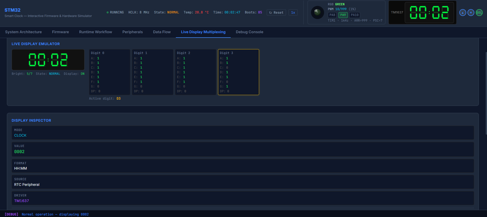

Expandable configuration cards for every peripheral — verify register settings without reading CubeMX output.

### Runtime Timeline

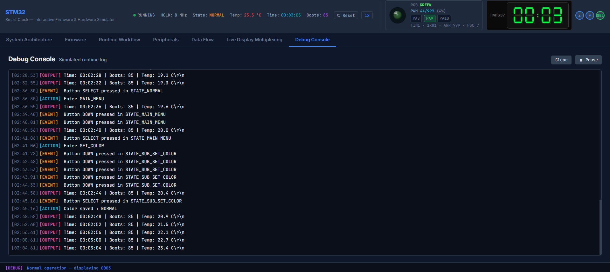

15-step boot sequence and 6-phase super-loop visualized with timing annotations.

---

## System Overview

The firmware is organized as a 5-layer bare-metal stack.

<p align="center">
  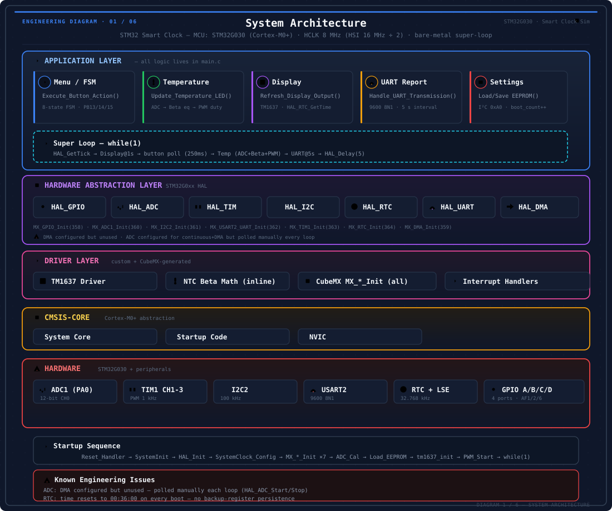
</p>

- **Application** — Menu FSM, temperature sensing, display management, UART reporting, settings persistence
- **Driver** — TM1637 bit-banged protocol, NTC Beta math, CubeMX init code
- **HAL** — STM32G0xx hardware abstraction (GPIO, ADC, TIM, I²C, RTC, UART, DMA)
- **CMSIS-Core** — Cortex-M0+ core: SysTick, NVIC, startup vector table
- **Hardware** — STM32G030 MCU, NTC thermistor, TM1637 display, EEPROM, RGB LED, buttons, LSE

The super-loop dispatches all application modules sequentially. HAL calls are blocking and synchronous — no interrupts are used for peripheral I/O (only SysTick for the 1 ms timebase). The firmware is compiled with ARM Compiler 5/6 through Keil MDK-ARM v5, with CubeMX generating the peripheral initialization code.

---

## Hardware

The system connects analog sensing, digital interfaces, user input, and output devices through STM32 peripherals.

<p align="center">
  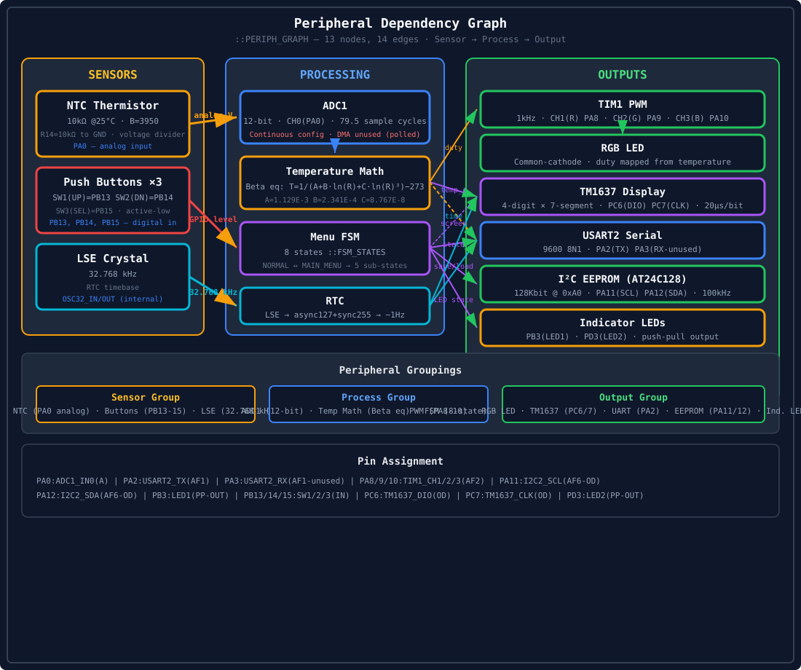
</p>

- **Sensors** (left): NTC thermistor (analog voltage), push buttons (GPIO level), LSE crystal (32.768 kHz)
- **Processing** (center): ADC1 quantization, temperature math (Beta equation), Menu FSM (8 states), RTC (BCD timekeeping)
- **Outputs** (right): TIM1 PWM + RGB LED, TM1637 4-digit display, USART2 serial, I²C EEPROM, indicator LEDs

Detailed pin mapping is available in [HARDWARE.md](docs/HARDWARE.md).

---

## Firmware Design

<p align="center">
  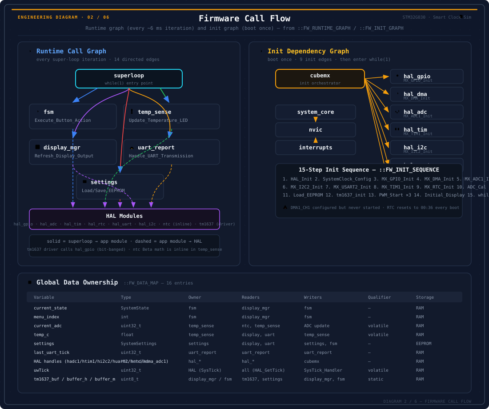
</p>

The super-loop calls 5 application modules every ~6 ms iteration. Each module calls into the HAL layer, which abstracts the STM32G030 peripheral registers behind a standard API. The TM1637 driver is the exception — it bypasses application code and calls `HAL_GPIO` directly for its bit-banged protocol at 20 µs/bit. NTC Beta math is inline inside the temperature processing function, running Steinhart-Hart coefficients on a Cortex-M0+ with no FPU.

On boot, the firmware executes 9 initialization edges from the CubeMX orchestrator to each HAL module, followed by system clock configuration (HSI → HCLK 8 MHz), ADC calibration, EEPROM settings load, TM1637 init, and PWM start on all 3 channels. The init sequence completes in under 50 ms.

Sixteen global variables track system state, with ownership distributed across modules. Variables like `temp_c` (volatile float, owned by temp_sense) are read by multiple modules — the data ownership map in the simulator's Firmware Debugger tab traces every read/write dependency.

---

## Finite State Machine

An 8-state, 12-transition menu system driven by 3 buttons (UP/DOWN/SELECT). All sub-states write to EEPROM on save. The FSM is polled from the super-loop — no interrupt-driven state machine.

<p align="center">
  
</p>

| State          | Trigger                | Behavior                                 |
| -------------- | ---------------------- | ---------------------------------------- |
| NORMAL         | —                      | Clock display, all systems active        |
| MAIN_MENU      | SW3 (1.5s hold)        | 5-item menu: SET, DISP, COLOR, INT, UART |
| SET_TIME_H     | SEL @ 0                | Hours adjustment (0–23)                  |
| SET_TIME_M     | SEL(3) from SET_TIME_H | Minutes adjustment (0–59)                |
| TOGGLE_DISPLAY | SEL @ 1                | Display on/off                           |
| SET_COLOR      | SEL @ 2                | LED color selection (0=R, 1=G, 2=B)      |
| UART_INTERVAL  | SEL @ 3                | Report interval (1–99 s)                 |
| UART_TOGGLE    | SEL @ 4                | UART on/off                              |

Full transition table and state details in [FSM.md](docs/FSM.md).

---

## Signal Flow

Six end-to-end signal chains trace every path from sensor to actuator.

<p align="center">
  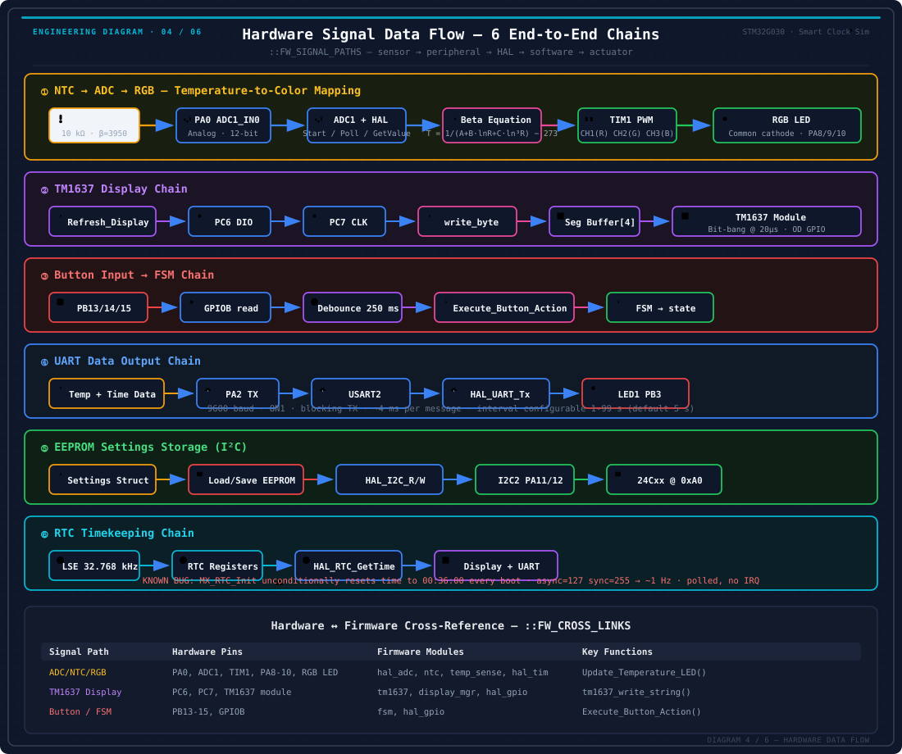
</p>

- **NTC → ADC → Temperature → PWM → RGB** — Analog voltage to colored light, routed through the Beta equation and duty cycle mapping
- **Buttons → FSM → Display / EEPROM** — User input drives the menu state machine, which controls display output and persists settings
- **RTC → Display / UART** — Time kept by the LSE crystal feeds both the display refresh and periodic serial reports

---

## Runtime Behavior

<p align="center">
  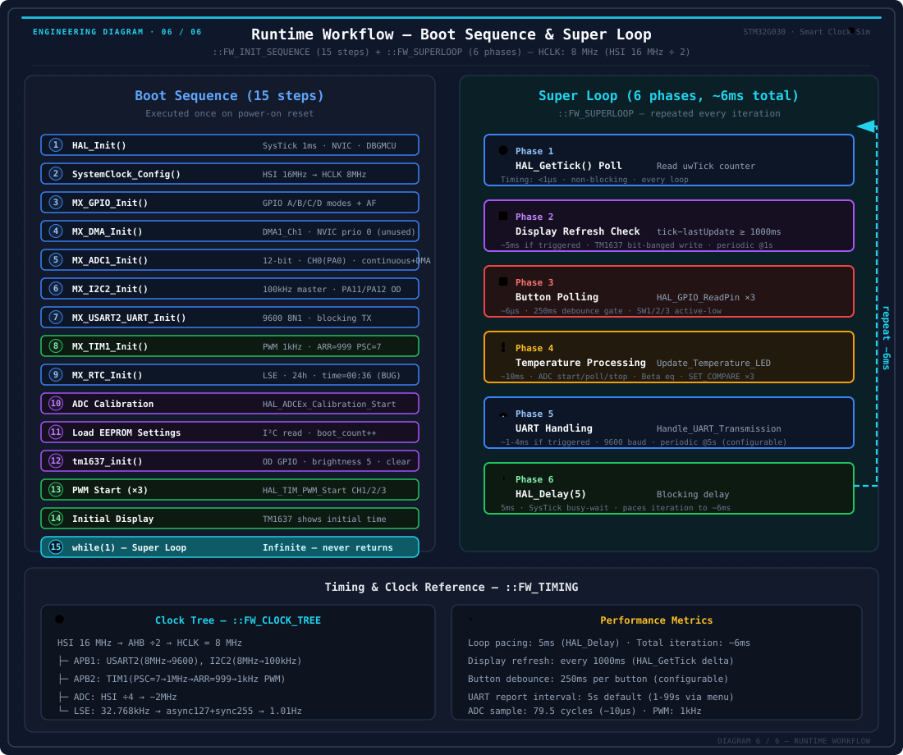
</p>

### Boot Sequence (15 steps)

HAL_Init → SystemClock_Config → 7× MX peripheral init → ADC calibration → EEPROM load → TM1637 init → PWM start (×3) → initial display → `while(1)`

### Super-Loop (6 phases, ~6 ms)

- **HAL_GetTick poll** — Every loop
- **Display refresh** — Every 1 s
- **Button polling (×3)** — Every loop, 250 ms debounce gating
- **Temperature processing** — Every loop
- **UART handling** — Every 5 s (configurable)
- **HAL_Delay(5)** — 5 ms pacing, every loop — ensures consistent iteration timing

---

## Engineering Highlights

- **Data-driven SVG visualization** — Every diagram in `docs/assets/` is generated from the same data structures that drive the simulator (`FW_LAYERS`, `PERIPH_GRAPH`, `FSM_STATES`, `FW_RUNTIME_GRAPH`). SVGs stay in sync with the code because they share the same source of truth — no manual diagramming.

- **Bit-level TM1637 simulation** — The simulator reproduces the exact bit-banged protocol: START condition, address frame (0x40 command), 4 data frames (8-bit segment patterns), ACK bit sampling, STOP condition — all visible at the GPIO level in the Live Display tab.

- **STM32 peripheral modeling** — ADC (12-bit, 79.5 cycle sample, continuous mode), TIM1 (1 kHz PWM, 3 independent channels), RTC (LSE 32.768 kHz → async 127 / sync 255 divider chain), I²C (START/STOP/ACK generation) — all modeled at register-level accuracy.

- **Browser-based debugging** — 7 debug tabs, animated particle signal propagation, ring-buffered 1000-line console log, step-through FSM animation — zero dependencies, single HTML file, runs on GitHub Pages.

- **Bare-metal architecture on Cortex-M0+** — 5-layer stack with no FPU and no RTOS. Inline Beta equation using Steinhart-Hart coefficients (A=1.129E-3, B=2.341E-4, C=8.767E-8). Sub-25 µs button polling with 250 ms software debounce.

---

## Roadmap

### Phase 1 — Critical

- ADC: switch to single conversion, remove unused DMA config
- RTC: add backup register check to preserve time across resets
- PWM: add duty clamping for sub-zero temperature readings

### Phase 2 — Performance

- Replace `float` + `logf()` with fixed-point + lookup table
- Replace `snprintf` with direct integer formatting for TM1637
- Reduce ADC sampling to 1 Hz

### Phase 3 — Architecture

- Split `main.c` into `temperature.c`, `display.c`, `menu.c`, `settings.c`
- Add EEPROM magic number + version + CRC16 validation
- Add IWDG watchdog (4 s timeout)

---

## Quick Start

```bash
git clone https://github.com/mohsensafari83/stm32-smart-clock.git
cd stm32-smart-clock
# Open index.html in your browser — no build system, no dependencies
```

The simulator runs entirely in the browser. For the firmware build, open `FINAL.ioc` with STM32CubeMX and the `MDK-ARM/` project with Keil MDK-ARM v5.

---

## Project Structure

```
STM32-SMART-CLOCK/
├── index.html              ← Interactive simulator (~9900 lines, single-file)
├── Core/                   ← Firmware source + headers
├── Drivers/                ← STM32G0xx HAL + CMSIS-Core
├── MDK-ARM/                ← Keil MDK-ARM project
└── docs/
    ├── assets/             ← 6 data-driven SVG diagrams
    └── screenshots/        ← Simulator screenshots
```

---

<p align="center">
  <sub>Firmware by Mohsen Safari · Simulator built with JavaScript, SVG, and GitHub Pages · STM32CubeMX + Keil MDK-ARM</sub>
</p>
