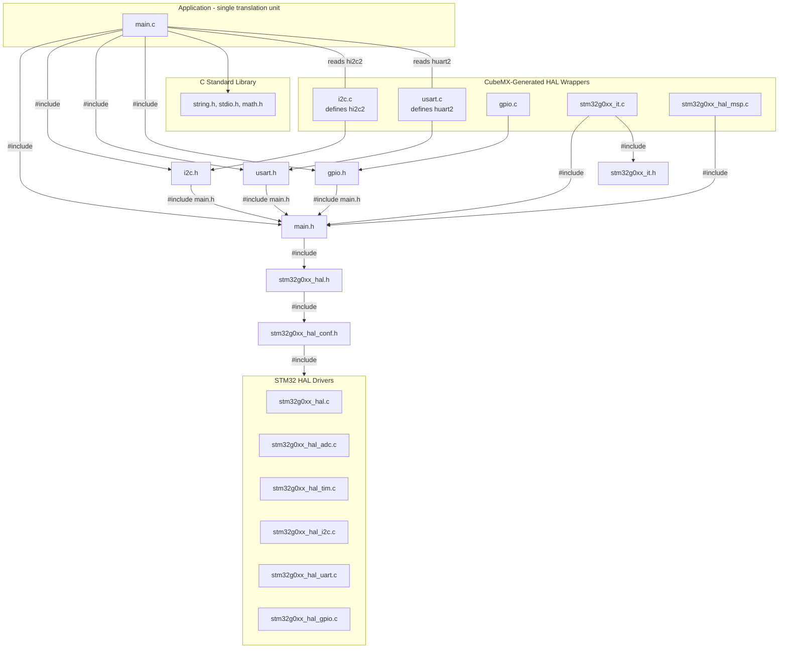
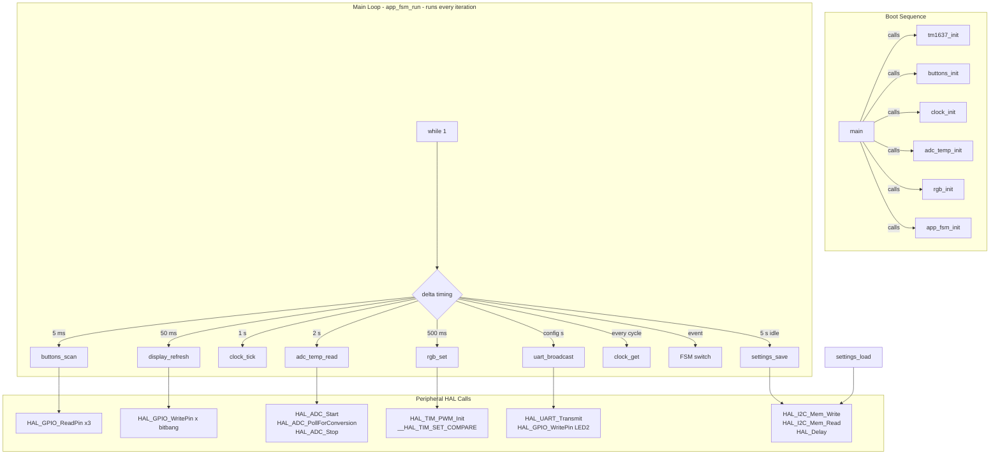

# Dependency Graph — Engineering Audit (v2 Flat)

## 1. Static Dependency Graph (`#include`)



### Anomaly Fixed — Redundant `extern` Declarations Removed

Previously `main.c` duplicated extern declarations that already existed in the included headers. These were removed in the refactor — no redundant externs remain.

| Removed | Already declared in |
|---------|---------------------|
| `extern I2C_HandleTypeDef hi2c2;` | `i2c.h:35` |
| `extern UART_HandleTypeDef huart2;` | `usart.h:35` |

---

## 2. Runtime Dependency Graph



---

## 3. Structural Analysis

### Circular Dependencies

**None detected.** The dependency graph is a strict DAG:

```
main.c → CubeMX headers → HAL headers → CMSIS
main.c → CubeMX .c files (via extern handles only)
```

No module depends on `main.c`. `main.c` is the single root.

### GOD Module Detection

| Module | Source Lines | % of Total | Role |
|--------|-------------|------------|------|
| **main.c** | 1134 | **100%** | All logic, all state, all peripheral init, all HAL calls |

**Verdict:** `main.c` is a GOD file. This is intentional (single-file project), but it means:
- All coupling is internal — impossible to test subsystems in isolation
- Any change touches the same file
- No separation of concerns at the translation-unit level

### Over-Coupled Modules

Since the entire application is one file, the question of "over-coupling between modules" does not apply in the traditional sense. However, within the file:

| Internal Function Group | External Dependencies | Coupling Level |
|------------------------|----------------------|----------------|
| TM1637 bitbang (180–365) | `HAL_GPIO_WritePin`, `HAL_GPIO_ReadPin` | Minimal — pure bitbang |
| Clock (436–470) | None (pure C) | **Zero** — weakly coupled |
| ADC (474–535) | `HAL_ADC_*` | Tight to ADC HAL, but expected |
| RGB (538–585) | `HAL_TIM_PWM_*` | Tight to TIM HAL, but expected |
| EEPROM (599–615) | `HAL_I2C_Mem_*` | Tight to I2C HAL, but expected |
| Buttons (620–696) | `HAL_GPIO_ReadPin` | Expected for GPIO input |
| FSM (700–1052) | All of the above | **Maximum coupling** — FSM touches every subsystem |

### Summary Table

| Metric | Result |
|--------|--------|
| Circular dependencies | 0 |
| GOD modules | 1 (`main.c`) |
| Translation units (app logic) | 1 |
| Redundant extern declarations | 0 (fixed) |
| HAL layer purity | Clean — CubeMX files are pure leaf nodes |
| Standard lib dependencies | `string.h`, `stdio.h`, `math.h` |

---

## Engineering Verdict (3 lines max)

No circular dependencies. The single-file design collapses all coupling into one translation unit — acceptable for a student project but not testable in isolation. All redundant extern declarations have been removed.
