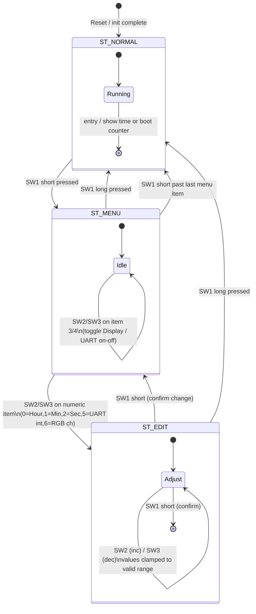

# FSM — UML State Diagram

## FSM Rules Summary

1. **ST_NORMAL** — Default state. Displays time (or boot counter for 2 s after reset). SW1 short enters the menu.
2. **ST_MENU** — Seven items (Hour → Min → Sec → Display toggle → UART toggle → UART interval → RGB channel). SW1 advances; past item 6 returns to normal. SW2/SW3 toggle items 3–4 or enter ST_EDIT for numeric items. SW1 long returns to normal.
3. **ST_EDIT** — SW2 increments, SW3 decrements the selected value. SW1 short confirms and returns to menu. SW1 long aborts to normal.
